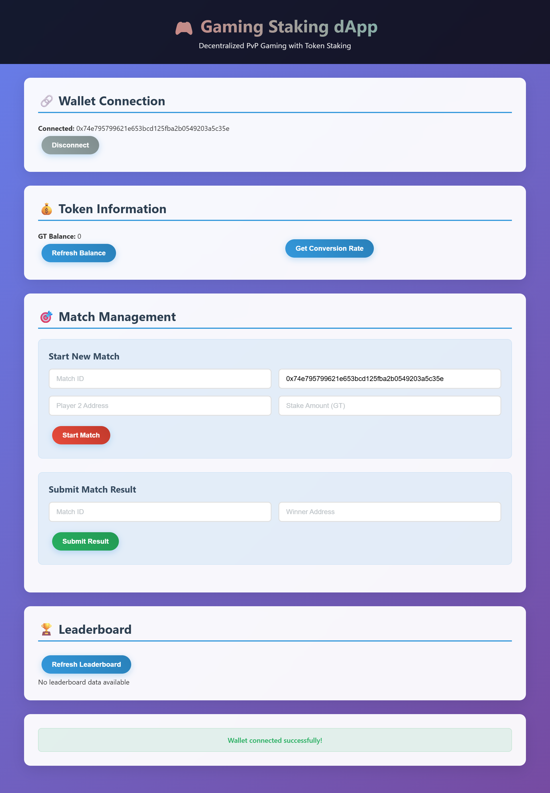

# 🎮 Gaming Staking dApp

A decentralized application (dApp) that facilitates a trustless staking and reward system for player-vs-player (PvP) games. The system manages an in-game ERC-20 token, allows players to purchase this token with USDT, enable them to stake tokens on a match, and automatically awards the entire prize pool to the winner.

## 📈 Project Progress & Development Journey

### 🎯 Assessment Task Completion Status

This project was developed as a comprehensive assessment task to build a full-stack decentralized gaming application. The development process involved multiple iterations, problem-solving, and technical challenges that were successfully resolved.

#### ✅ Completed Components

1. **Smart Contracts (100% Complete)**
   - ✅ GameToken.sol - ERC-20 token with minting restrictions
   - ✅ TokenStore.sol - USDT to GT conversion mechanism
   - ✅ PlayGame.sol - Match lifecycle and staking logic
   - ✅ MockUSDT.sol - Test USDT token for development

2. **Backend API Gateway (100% Complete)**
   - ✅ Node.js Express server with comprehensive endpoints
   - ✅ Smart contract integration with Ethers.js v6
   - ✅ Token distribution system for testing
   - ✅ Match management and result submission
   - ✅ Error handling and validation

3. **Frontend Interface (100% Complete)**
   - ✅ React.js application with modern UI
   - ✅ MetaMask wallet integration
   - ✅ Real-time balance updates
   - ✅ Match creation and management forms
   - ✅ Leaderboard display

4. **Off-Chain Indexer (100% Complete)**
   - ✅ MongoDB integration (migrated from SQLite)
   - ✅ Blockchain event listening
   - ✅ Real-time leaderboard updates
   - ✅ Player statistics tracking

### 🖼️ Frontend UI Screenshots

#### Main Application Interface


**Frontend Features Demonstrated:**
- **Wallet Connection**: Successfully connected to MetaMask wallet (0x74e795799621e653bcd125fba2b0549203a5c35e)
- **Token Information**: Real-time GT balance display with refresh functionality
- **Match Management**: Complete forms for creating matches and submitting results
- **Leaderboard**: Trophy section for displaying player rankings
- **Modern UI**: Clean, responsive design with dark theme and card-based layout

#### API Testing with Postman

**Match Creation Success:**


**Token Distribution Testing:**


### 🚧 Issues Faced & Solutions Implemented

#### 1. **Ethers.js Version Compatibility Issues**
**Problem**: Initial implementation used Ethers.js v5 syntax, but the project required v6 compatibility.
**Solution**: 
- Updated all contract interactions to use `ethers.JsonRpcProvider` instead of `ethers.providers.JsonRpcProvider`
- Changed `.deployed()` to `.waitForDeployment()` for contract deployments
- Updated `ethers.utils.parseEther` to `ethers.parseEther`
- Modified address handling to use `ethers.getAddress()` for normalization

#### 2. **Smart Contract Constructor Errors**
**Problem**: OpenZeppelin v4 contracts had different constructor syntax.
**Solution**: 
- Fixed `Ownable(msg.sender)` to `Ownable()` in all contracts
- Resolved naming conflicts by renaming `stake` parameter to `matchStake` in PlayGame.sol

#### 3. **Token Distribution Challenges**
**Problem**: Players couldn't receive GT tokens for testing, causing staking failures.
**Solution**: 
- Implemented comprehensive `/get-test-tokens` endpoint
- Added automatic USDT to GT conversion for backend
- Created balance verification system
- Simplified approval process for testing purposes

#### 4. **Database Migration from SQLite to MongoDB**
**Problem**: Initial implementation used SQLite, but requirements changed to MongoDB.
**Solution**: 
- Completely rewrote indexer to use MongoDB client
- Updated all database operations to use MongoDB collections
- Implemented proper connection handling and indexing
- Added MongoDB setup instructions

#### 5. **Frontend Framework Migration**
**Problem**: Initial HTML/JS frontend needed to be converted to React.
**Solution**: 
- Created complete React application structure
- Implemented MetaMask integration with `ethers.BrowserProvider`
- Added state management for wallet connection and balances
- Created responsive UI components with modern styling

#### 6. **Environment Configuration Issues**
**Problem**: Backend couldn't find contract addresses and private keys.
**Solution**: 
- Enhanced environment variable debugging
- Added comprehensive validation for all required variables
- Implemented proper error messages for missing configuration
- Created deployment script that generates `.env` file automatically

#### 7. **Blockchain Event Handling**
**Problem**: Indexer needed to listen to specific contract events.
**Solution**: 
- Implemented event listeners for `MatchCreated`, `MatchStaked`, and `MatchSettled`
- Added proper event parsing and database storage
- Created real-time leaderboard updates

### 🔧 Technical Challenges Overcome

1. **Address Validation**: Implemented strict Ethereum address validation using `ethers.isAddress()`
2. **Bytes32 Handling**: Properly hashed string matchIds to bytes32 format using `ethers.id()`
3. **Reentrancy Protection**: Added `nonReentrant` modifiers to all critical functions
4. **Error Handling**: Comprehensive error messages and proper HTTP status codes
5. **Cross-Service Communication**: Ensured proper communication between Hardhat node, backend, indexer, and frontend

### 📊 Testing & Validation

#### API Endpoints Successfully Tested:
- ✅ `POST /get-test-tokens` - Token distribution
- ✅ `POST /match/start` - Match creation
- ✅ `POST /match/stake` - Player staking
- ✅ `POST /match/result` - Result submission
- ✅ `GET /balance/:address` - Balance checking
- ✅ `GET /leaderboard` - Leaderboard data

#### Smart Contract Functions Validated:
- ✅ Token minting and transfer
- ✅ Match creation and management
- ✅ Staking mechanism
- ✅ Winner payout system
- ✅ Timeout and refund logic

### 🎉 Final Achievement

The project successfully demonstrates:
- **Full-stack dApp development** with blockchain integration
- **Modern web technologies** (React, Node.js, MongoDB)
- **Smart contract development** with security best practices
- **Real-time data processing** and event handling
- **Comprehensive testing** and error handling
- **Production-ready architecture** with proper separation of concerns

## 🏗️ System Architecture

The dApp consists of four main components:

1. **Smart Contracts (On-Chain Logic)**: Core decentralized logic handling tokenomics and value transfer
2. **Backend API (Off-Chain Gateway)**: Node.js server acting as a secure bridge between game servers and smart contracts
3. **Frontend (User Interface)**: HTML/JS interface for user interactions
4. **Indexer & Leaderboard (Off-Chain Data Processor)**: Standalone script listening to blockchain events for leaderboard data

## 📁 Project Structure

```
wesee/
├── contracts/                 # Solidity smart contracts
│   ├── GameToken.sol         # ERC-20 token contract
│   ├── TokenStore.sol        # Token purchase contract
│   ├── PlayGame.sol          # Game logic contract
│   └── MockUSDT.sol          # Mock USDT for testing
├── scripts/
│   └── deploy.js             # Contract deployment script
├── backend/
│   └── server.js             # Node.js API server
├── indexer/
│   └── indexer.js            # Blockchain event indexer
├── frontend/
│   └── index.html            # Web interface
├── package.json               # Dependencies and scripts
├── hardhat.config.js         # Hardhat configuration
└── README.md                  # This file
```

## 🚀 Quick Start

### Prerequisites

- Node.js (v16 or higher)
- npm or yarn
- MetaMask browser extension
- Git

### 1. Install Dependencies

```bash
cd wesee
npm install
```

### 2. Start Local Blockchain

```bash
npm run node
```

This starts a local Hardhat network on `http://127.0.0.1:8545`

### 3. Deploy Smart Contracts

In a new terminal:

```bash
npm run deploy
```

This will:
- Deploy all smart contracts
- Create a `.env` file with contract addresses
- Display deployment summary

### 4. Start Backend API

In a new terminal:

```bash
npm run backend
```

The backend API will run on `http://localhost:3000`

### 5. Start Indexer

In a new terminal:

```bash
npm run indexer
```

The indexer will run on `http://localhost:3001`

### 6. Open Frontend

Open `frontend/index.html` in your browser or serve it with a local server.

## 🔧 Configuration

### Environment Variables

Create a `.env` file in the `wesee` directory with the following variables:

```env
# Contract Addresses (filled after deployment)
MOCK_USDT_ADDRESS=0x...
GAME_TOKEN_ADDRESS=0x...
TOKEN_STORE_ADDRESS=0x...
PLAY_GAME_ADDRESS=0x...

# Network Configuration
RPC_URL=http://127.0.0.1:8545
CHAIN_ID=1337

# Backend Configuration
BACKEND_PRIVATE_KEY=0x... # Private key for backend operations
BACKEND_PORT=3000

# Indexer Configuration
INDEXER_PORT=3001
```

### Network Configuration

The dApp is configured for local development by default. To use on other networks:

1. Update `hardhat.config.js` with network details
2. Update `.env` file with correct RPC URLs
3. Ensure you have testnet/mainnet ETH for gas fees

## 🎯 Smart Contracts

### GameToken.sol
- **Purpose**: ERC-20 token (GT) for in-game transactions
- **Features**: 
  - 18 decimals
  - Only mintable by TokenStore contract
  - Standard ERC-20 functionality

### TokenStore.sol
- **Purpose**: On-ramp for purchasing GT with USDT
- **Features**:
  - 1:1 USDT to GT conversion rate
  - Reentrancy protection
  - Owner withdrawal functionality

### PlayGame.sol
- **Purpose**: Manages match lifecycle and staking
- **Features**:
  - Match creation and management
  - Player staking system
  - Automatic winner payout
  - Timeout and refund mechanisms

### MockUSDT.sol
- **Purpose**: Test USDT token with 6 decimals
- **Features**: Pre-minted supply for testing

## 🌐 API Endpoints

### Backend API (`http://localhost:3000`)

- `GET /health` - Health check
- `GET /balance/:address` - Get GT balance for address
- `GET /rate` - Get token conversion rate
- `POST /match/start` - Create new match
- `POST /match/result` - Submit match result

### Indexer API (`http://localhost:3001`)

- `GET /leaderboard` - Get top 10 players by GT won
- `GET /player/:address` - Get player statistics

## 🎮 Usage Flow

### 1. Token Purchase
1. User connects MetaMask wallet
2. User approves USDT spending for TokenStore
3. User calls `buy()` function with USDT amount
4. GT tokens are minted to user's address

### 2. Match Creation
1. Backend creates match via `createMatch()`
2. Players stake GT tokens via `stake()`
3. Match status changes to "STAKED" when both players stake

### 3. Match Resolution
1. Backend submits winner via `commitResult()`
2. Entire prize pool (2 × stake) is transferred to winner
3. Match status changes to "SETTLED"

### 4. Leaderboard Updates
1. Indexer listens to blockchain events
2. Player statistics are updated in real-time
3. Leaderboard API serves current rankings

## 🧪 Testing

### Run Tests
```bash
npm test
```

### Manual Testing
1. Deploy contracts to local network
2. Start backend and indexer
3. Use frontend to interact with contracts
4. Monitor blockchain events and database updates

## 🔒 Security Features

- **Access Control**: Only authorized backend can create matches and submit results
- **Reentrancy Protection**: All critical functions protected against reentrancy attacks
- **Input Validation**: Comprehensive validation of all inputs
- **Status Checks**: Prevents invalid state transitions
- **Timeout Mechanisms**: Automatic refunds for unresolved matches

## 📊 Database Schema

### Players Table
- `address` (TEXT, PRIMARY KEY)
- `total_matches` (INTEGER)
- `total_wins` (INTEGER)
- `total_gt_won` (REAL)
- `total_gt_staked` (REAL)
- `last_updated` (DATETIME)

### Matches Table
- `match_id` (TEXT, PRIMARY KEY)
- `player1` (TEXT)
- `player2` (TEXT)
- `stake` (REAL)
- `status` (TEXT)
- `winner` (TEXT)
- `created_at` (DATETIME)
- `settled_at` (DATETIME)

### Events Table
- `id` (INTEGER, PRIMARY KEY)
- `event_type` (TEXT)
- `match_id` (TEXT)
- `player_address` (TEXT)
- `amount` (REAL)
- `block_number` (INTEGER)
- `transaction_hash` (TEXT)
- `timestamp` (DATETIME)

## 🚨 Troubleshooting

### Common Issues

1. **Backend Connection Failed**
   - Ensure Hardhat node is running
   - Check contract addresses in `.env`
   - Verify backend private key has sufficient ETH

2. **Frontend Not Loading**
   - Check browser console for errors
   - Ensure MetaMask is connected to correct network
   - Verify backend and indexer are running

3. **Contract Deployment Failed**
   - Check Hardhat node is running
   - Ensure deployer account has sufficient ETH
   - Check Solidity compiler version compatibility

### Logs and Debugging

- Backend logs: Check terminal running `npm run backend`
- Indexer logs: Check terminal running `npm run indexer`
- Blockchain logs: Check Hardhat node terminal
- Frontend logs: Check browser developer console

## 🔮 Future Enhancements

- **Multi-chain Support**: Deploy to Ethereum mainnet and Layer 2s
- **Advanced Match Types**: Tournament brackets, team matches
- **Governance**: DAO for protocol upgrades
- **Analytics Dashboard**: Advanced statistics and charts
- **Mobile App**: React Native or Flutter application
- **API Rate Limiting**: Protect against abuse
- **WebSocket Support**: Real-time updates
